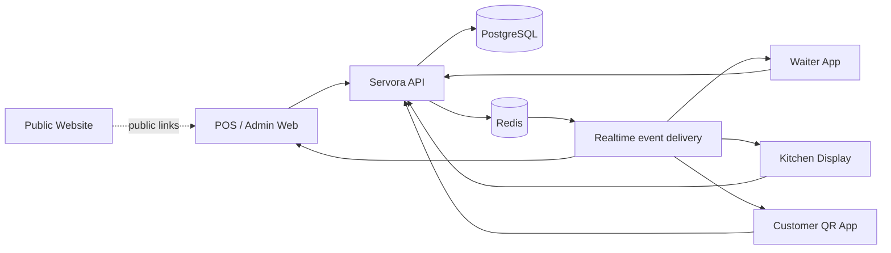
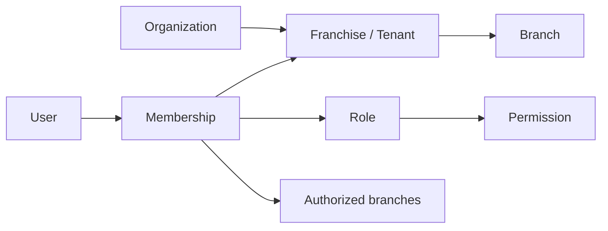
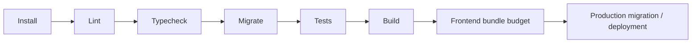

# Servora Architecture

## Purpose

This document is the maintained architectural overview for Servora. It describes the boundaries that should remain stable as the product evolves and is intended to support engineering reviews, onboarding, and interview/portfolio discussion without relying on historical implementation plans.

## System overview



Servora is a Bun/Turborepo TypeScript monorepo. The backend is the authority for tenant isolation, permissions, pricing, availability, inventory effects, payments, and order state. Frontend applications present those decisions and keep local interaction state responsive, but must not duplicate authoritative business rules.

## Applications

- `apps/api` — Elysia HTTP API, domain services, persistence, migrations, Redis integration, and realtime event production.
- `apps/web` — POS/admin application for owners, franchise administrators, managers, and authorized operational roles.
- `apps/waiter-app` — waiter-focused ordering and service workflows.
- `apps/kitchen-display` — kitchen ticket execution and status workflows.
- `apps/customer-app` — QR/customer ordering experience.
- `apps/website` — Next.js public marketing/SEO surface.

## Shared packages

- `@pos/api-client` — typed API access and shared authentication/refresh behavior.
- `@pos/config` — shared configuration.
- `@pos/observability` — browser Web Vitals/runtime telemetry primitives.
- `@pos/realtime` — shared realtime client and React hooks.
- `@pos/types` — shared domain contracts.
- `@pos/ui` — reusable UI primitives and theme system.
- `@pos/validation` — shared validation schemas.

## Frontend architecture

```mermaid
flowchart TD
  Route[Route] --> Page[Feature page]
  Page --> Hook[Feature hook / query]
  Hook --> Client[@pos/api-client]
  Client --> API[HTTP API]
  Page --> UI[@pos/ui]
  Realtime[@pos/realtime] --> Hook
  Auth[Auth / permission context] --> Route
  Auth --> Page
```

Frontend code is organized by feature. Page components coordinate user workflows; hooks and services own data access; shared components are reserved for behavior used by multiple features. Navigation and actions must be permission-aware while the API remains the final authorization boundary.

### State ownership

- **Server state:** TanStack Query.
- **Authentication and active business context:** Zustand plus persisted context where explicitly required.
- **Transient component state:** React state.
- **Realtime:** shared realtime package invalidates or updates server-state caches.
- **Business rules:** backend/domain services, not client stores.

## Multi-tenancy and authorization



Every sensitive API operation must derive scope from authenticated membership/authorization context. UI permission checks improve navigation and usability but never substitute for server authorization.

## Pricing and availability authority

Pricing, tax, discounts, branch overrides, modifiers, combos, and availability are calculated or resolved by the backend. Clients should render server evidence and explanation rather than recalculate final commercial values independently.

The explainability layer exists to surface the evidence behind important decisions such as order totals, availability outcomes, and state transitions.

## Realtime architecture

Operational events are produced by authoritative backend workflows and delivered through the shared realtime layer. Frontends use events to update/invalidate cached data and show time-sensitive notifications. Realtime messages are treated as synchronization hints; sensitive state is still verified through authorized API reads.

## Observability

Frontend applications use `@pos/observability` to collect sampled Core Web Vitals and runtime failures. The package currently captures LCP, INP, CLS, TTFB, uncaught errors, and unhandled promise rejections. Telemetry is sent to the first-party `/api/telemetry/frontend` collector by default; `VITE_FRONTEND_TELEMETRY_URL` can override the destination for a dedicated collector. Development builds also log events locally.

Backend performance/release scripts remain separate from browser telemetry so that server and client regressions can be reasoned about independently.

## Performance budgets

`bun run verify:frontend-performance` inspects production Vite artifacts and enforces conservative JavaScript bundle budgets for the operational React applications. CI runs this check after production builds. Budgets should only be tightened intentionally after measuring the deployed applications; they should not be relaxed merely to make a regression pass.

## Reliability principles

1. Treat authentication bootstrap and API cold starts as explicit application states.
2. Keep realtime disconnect/reconnect behavior recoverable.
3. Preserve idempotency and immutable evidence where order/payment correctness depends on history.
4. Fail closed on authorization ambiguity.
5. Make unavailable/error states actionable rather than silently rendering stale assumptions.

## Testing strategy

- Vitest for unit/integration behavior.
- React Testing Library for component behavior and accessibility semantics.
- Playwright for browser workflows.
- Axe checks for key accessibility paths.
- Migration and RBAC verification scripts for architectural invariants.
- Release smoke tooling for deploy-time confidence.
- Frontend bundle budgets for performance regression detection.

Critical restaurant workflows should have vertical tests across routing, authorization, API/domain behavior, persistence, and UI where practical.

## CI/CD quality gate



A change is not complete when it only passes a local component test. The repository-level quality gate is the contract for integration safety.
